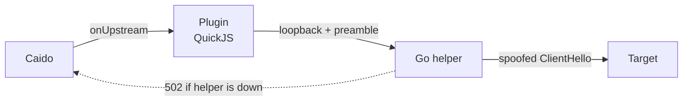

<div align="center">

# 🎭 TLS Imposter

**Give Caido's outbound connections the TLS and HTTP/2 fingerprint of a real browser.**

[](https://caido.io)
[](#-requirements)
[](https://go.dev)
[](#-credits)
[](#-development)

</div>

---

## 🧩 The problem

Caido's own TLS stack is distinctive. It offers **31 ciphers**, **11 extensions**, and **no ALPN** — so it negotiates HTTP/1.1 and presents no HTTP/2 fingerprint at all, while your requests carry a Chrome `User-Agent`.

That combination is self-contradictory. A WAF can separate it from browser traffic on the handshake alone, before reading a single byte of your request. Your authorized testing then measures the WAF's opinion of your tooling instead of the target's behaviour.

## ✨ What you get

Measured through Caido against `tls.peet.ws/api/all`:

| | 🔴 Plugin off | 🟢 Plugin on |
|---|---|---|
| `http_version` | `HTTP/1.1` | **`h2`** |
| `tls.ja3_hash` | `c199b43d…1ce3e` | `f984bd5b…a2e89` |
| `tls.ja4` | `t13d3111_e8f1e7e78f70_…` | `t13d1516h2_8daaf6152771_…` |
| `http2.akamai_fingerprint_hash` | *absent* | `52d84b11…5ca86` |

Also confirmed on the wire:

- 🔹 HTTP/2 pseudo-header order arrives as Chrome's — `m,a,s,p`
- 🔹 Your request header order is preserved **exactly as written**
- 🔹 GREASE, X25519MLKEM768 and `application_settings` (ALPS) all present
- 🔹 Fails **closed** — a dead helper returns 502 rather than leaking an unspoofed request

## 🚀 Quick start

```bash
pnpm install
pnpm build        # cross-compiles the Go helper, then bundles the package
```

Then in Caido:

| | Step |
|---|---|
| 1️⃣ | **Plugins → Install from file** → `dist/plugin_package.zip` |
| 2️⃣ | Enable **both** components — backend *and* frontend |
| 3️⃣ | Open the **TLS Imposter** page, confirm **Helper: Running** |
| 4️⃣ | Click **Enable for all domains** |

> [!IMPORTANT]
> **Step 4 is not optional.** Caido only hands a request to a plugin when one of its *Upstream Plugins* rules matches the target. Until a rule exists, **no traffic reaches this plugin and your fingerprint is unchanged.** Installing it is not enough.

Per-host rules live in **Settings → Upstream → Upstream Plugins**.

## 🎯 Choosing a profile

83 profiles ship with the plugin — 28 Chrome, 16 Firefox, 10 Safari/iOS, plus Brave, Opera and mobile apps.

**Match the profile to the browser whose headers pass through.** A `chrome_152` handshake under a Chromium 147 `User-Agent` is a new mismatch replacing the old one.

Two browsers measured by capturing their real ClientHello off the wire:

| Browser | Measured JA4 | Profile |
|---|---|---|
| 🧩 Caido's bundled Chromium **147** | `t13d1517h2_8daaf6152771_dcad5a053991` | **`chrome_146`** ← default |
| 🌐 Google Chrome **154** | `t13d1517h2_8daaf6152771_cb7bf5808d99` | **`chrome_152`** |

The default is `chrome_146` because Caido drives its own browser. Revisit it when Caido ships a newer Chromium.

<details>
<summary><b>How to measure your own browser</b></summary>

Presets drift from whatever you actually run, and the difference is measurable — `chrome_146` and `chrome_152` have an *identical* extension set and differ only in signature algorithms.

1. **Turn routing off.** With it on you measure the preset, not your browser — the reading is circular.
2. Open `https://tls.peet.ws/api/all` in the browser you drive.
3. Read `tls.ja4`.
4. Pick the profile whose JA4 matches, then turn routing back on.

</details>

## 🧪 Verify it works

Replay `https://tls.peet.ws/api/all` and check `http_version` is `h2`.

## 🏗️ How it works

Caido's backend plugin runtime is **QuickJS**. It offers raw sockets but no control over ClientHello construction or HTTP/2 framing — which is the entire point of the plugin. So the work happens in a Go helper, shipped as a backend asset:



1. Caido matches its upstream rule and calls the plugin's `onUpstream` hook.
2. The plugin opens a loopback connection to the helper, writes a one-line preamble carrying that request's target, profile and timeout, and hands Caido the connection.
3. The helper replays the request through `tls-client` under the chosen profile and writes the response back down the same socket.

Three properties worth knowing:

- 🔄 **Stateless about settings** — every connection carries its own configuration, so restarting the helper loses nothing.
- 🔒 **The helper owns anything long-lived** — Caido's backend SDK has no unload hook, so a plugin can never release what it opens. The helper exits when its stdin closes, so it cannot outlive the plugin.
- 🛑 **Fails closed** — unexpected 502s on a routed host mean *check Helper status*, not *the plugin is broken*.

## 📸 Capturing your own handshake

The capture listener is a transparent pipe in front of Caido, so you point one browser's proxy at it:

```
browser ──▶ capture listener :8886 ──(sniff)──▶ Caido :8080 ──▶ target
```

Enable **Capture**, then start a browser aimed at it (Windows `cmd` — the `^` continuations are cmd syntax):

```bat
"C:\Program Files\Google\Chrome\Application\chrome.exe" ^
  --proxy-server="http://127.0.0.1:8886" ^
  --user-data-dir="%TEMP%\tls-imposter-capture" ^
  --ignore-certificate-errors ^
  --no-first-run --no-default-browser-check ^
  --disable-background-networking --disable-sync --disable-component-update ^
  "https://tls.peet.ws/api/all"
```

> [!WARNING]
> **`--user-data-dir` must name a directory no running Chrome is using.** Otherwise the new `chrome.exe` hands its URL to the existing instance and silently discards every other flag, proxy included — the usual reason capture appears to do nothing.

> [!CAUTION]
> **Check what you actually captured.** `--proxy-server` routes *all* of the browser's traffic through the listener and the newest handshake wins, so background connections can overwrite the one you wanted. Chrome's push channel (`mtalk.google.com`) is the usual culprit, and being raw TLS rather than HTTPS its handshake carries **no ALPN** — selecting it gives up HTTP/2 entirely. A usable capture has a JA4 ending in `h2`.

Firefox is easier here: its proxy setting is in the UI, and `dom.push.enabled=false` in `about:config` actually silences the background chatter.

Then switch the fingerprint source to `captured`. The handshake is stored, so turn Capture off afterwards and recapture when your browser updates.

## 🐛 Notes for bug bounty

**The payoff is that clearance cookies survive replay.** A `cf_clearance` cookie is bound to your IP, your `User-Agent`, and often your TLS fingerprint. Solve a challenge in the browser, and without this plugin your Replay request presents Caido's native handshake instead — the cookie is rejected and you're re-challenged mid-test for no visible reason. With the profile matched, the handshake is consistent and the cookie holds.

**What this does not fix**, roughly in order of impact:

| | |
|---|---|
| 🚫 **No JS execution** | Replay and Automate cannot answer a managed challenge, Turnstile, Akamai `sensor_data` or DataDome. Solve it in the browser, then replay inside that session. |
| 🌍 **IP reputation** | A datacentre ASN carries a standing penalty no handshake overcomes. |
| 📝 **Hand-written requests** | Caido sends exactly what you type. A real browser sends `sec-ch-ua`, `sec-ch-ua-mobile`, `sec-ch-ua-platform`, `upgrade-insecure-requests` and four `sec-fetch-*` headers. **Copy from Proxy history rather than typing requests.** |
| ⏱️ **Rate and concurrency** | Automate at default concurrency is the most common self-inflicted block. |

This removes one decisive signal. It is **not** a bot-detection bypass.

## 🔧 Troubleshooting

| Symptom | Cause |
|---|---|
| 502s on a routed host | Helper is down. It fails closed rather than sending unspoofed — check Status, press **Restart**. |
| Fingerprint unchanged | No routing rule, or it is disabled. |
| `Backend unavailable` on the page | The backend component is disabled while the page is enabled. Enable both. |
| Capture does nothing | A Chrome instance was already running — see the `--user-data-dir` warning above. |
| Captured JA4 does not end in `h2` | The wrong connection was captured. |
| Settings reset after an update | A reinstall assigns a new plugin id, so the data directory is new. Upstream rules are keyed by plugin id — re-check **Routing**. |

## ⚠️ Limitations

<details open>
<summary><b>Six things this cannot do</b></summary>

- **Response header order and casing are normalized** — Go's response model does not preserve them.
- **Responses are buffered** — SSE and long-polling do not stream, slow responses hit the timeout, large bodies occupy memory.
- **Malformed requests do not survive** the parse and rebuild. Turn routing off for hosts you send smuggling payloads to.
- **Caido's own upstream proxy does not apply** to routed traffic, because the helper opens the egress connection itself.
- **JA4 encodes the negotiated ALPN**, so relayed HTTP/1.1 traffic will not match the `h2` a browser shows.
- **A captured handshake pins one extension ordering.** Chrome randomizes that order per connection, so `captured` yields a JA3 that is *stable* where a real browser's varies. JA4 is unaffected — it sorts extensions.

</details>

Windows x64 only. Another platform is a `GOOS`/`GOARCH` change plus an extra asset.

## 🛠️ Development

```bash
pnpm test         # Go helper + backend suites
pnpm typecheck    # backend and frontend
pnpm build        # helper, both plugins, and the zip
```

| Layer | Stack |
|---|---|
| `helper/` | Go — TLS, HTTP/1.1, HTTP/2, WebSocket relay, capture, JA3/JA4 |
| `packages/backend/` | TypeScript on QuickJS — settings, helper supervision, `onUpstream` |
| `packages/frontend/` | Vue 3 — status, fingerprint and capture cards |

Design notes, probe results and acceptance measurements are in `docs/superpowers/specs/`.

## 📜 Credits

Built on:

- **[bogdanfinn/tls-client](https://github.com/bogdanfinn/tls-client)** — BSD-4-clause. Its advertising clause requires that advertising materials mentioning features or use of this software display the acknowledgement: *"This product includes software developed by the copyright holders."*
- **[bogdanfinn/utls](https://github.com/bogdanfinn/utls)**, a fork of **[refraction-networking/utls](https://github.com/refraction-networking/utls)** — BSD-3-clause

[sleeyax/burp-awesome-tls](https://github.com/sleeyax/burp-awesome-tls) (GPL-3.0) solves the same problem for Burp Suite and is where the approach of retargeting proxy traffic at a local Go server comes from. No code is shared with it — TLS Imposter is an independent implementation against Caido's plugin API.
